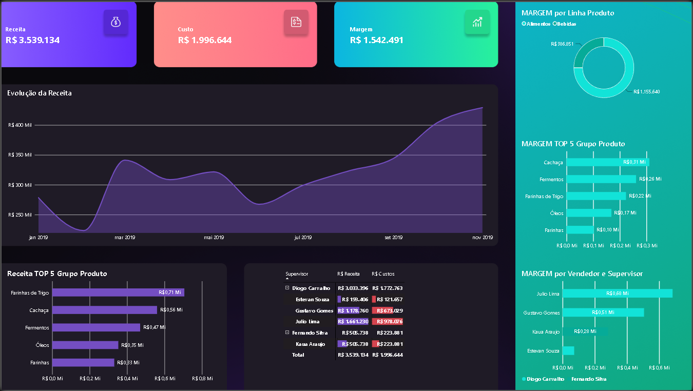

# 📊 Portfólio Power BI

Bem-vindo ao meu portfólio de dashboards desenvolvidos em **Power BI** durante minha graduação em **Análise e Desenvolvimento de Sistemas**.

Neste repositório apresento projetos focados em análise de dados, indicadores financeiros e criação de dashboards interativos.

---

# Dashboard Financeiro

Dashboard para acompanhamento de indicadores financeiros.

### Principais indicadores

- Receita
- Custos
- Margem
- Evolução da Receita
- Top 5 Produtos por Receita
- Top 5 Produtos por Margem
- Margem por Vendedor

### Preview

---

# Dashboard Financeiro Empresarial

Dashboard desenvolvido para análise de recebimentos, pagamentos e indicadores financeiros.

### Principais indicadores

- Recebimentos
- Pagamentos
- Receita
- Custos
- Despesas
- Lucro
- Evolução temporal
- Análise por Cliente
- Análise por Natureza
- Análise por Tipo

### Preview

---

## 🛠 Tecnologias utilizadas

- Power BI
- Power Query
- DAX
- Modelagem de Dados

---

## 👨‍💻 Autor

**Angelo Lopes**

Graduando em Análise e Desenvolvimento de Sistemas.